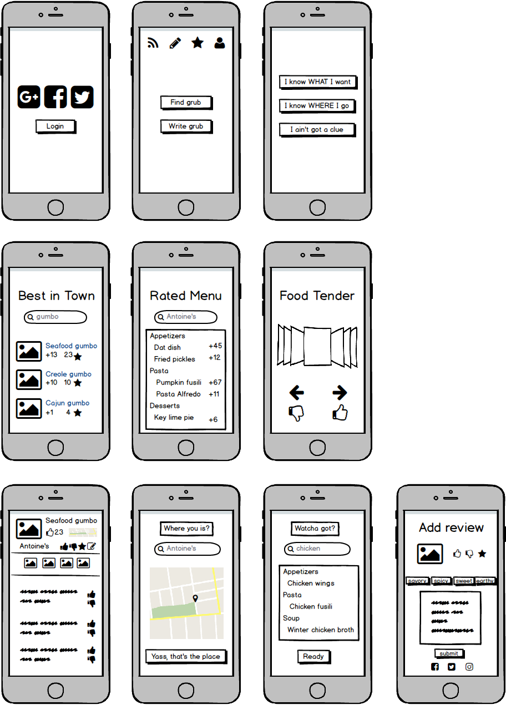
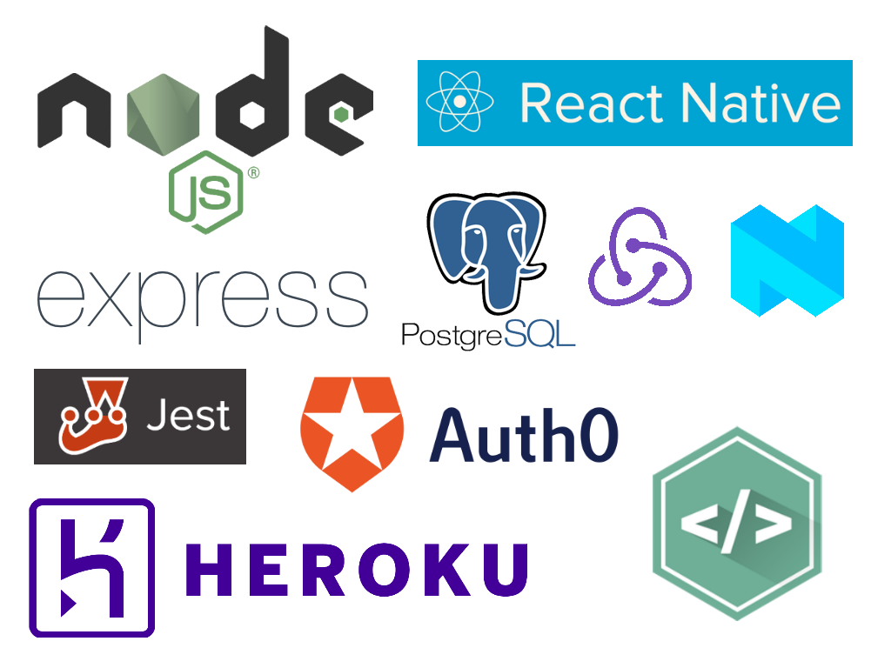

# Grubber

An app to help you find the best dishes in town

## Team

  - __Product Owner__: David d'Aquin
  - __Scrum Master__: Nathan Donolli
  - __Creative Director__: Živilė Janulevičiūtė Goodwin

## Table of Contents

1. [How it works](#how-it-works)
2. [App Wireframe](#wireframe)
3. [Architecture](#architecture)
4. [Database](#database)
5. [Tech Stack](#tech-stack)
6. [Development](#development)
  6. [System Requirements](#system-requirements)
  6. [Installation](#installation)
  6. [Simulate for iOS](#simulate-ios)
  6. [Simulate for Android](#simulate-android)
7. [Contributing](#contributing)

## <a name="how-it-works"></a>How it Works

> I'm starving for tacos!

Grubber's got your back. Grubber will help you find the best tacos in town!  Simply open the app and search "tacos" to see a list of all the best tacos in the city and where to buy them. Perfect! Go wolf one down and leave a thumbs up so others will know how delicious those tacos were!

> I'm at a restaurant and don't know what's good!

Easy. Just tell Grubber where you're at and you'll see the best rated dishes for that restaurant. Best onion rings in town? We know which side dish you'll be getting! Best bread pudding? Somebody's being a fatty tonight!

> I'm starving but don't know what I want! HALP!

Now introducing: __TENDER!__ A totally original idea where Grubber will present you with pictures of delicious local food and you can swipe left or right to get matched up with the perfect dish for the evening. Bon appetit!

## <a name="wireframe"></a>App Wireframe


## <a name="architecture"></a>Architecture


## <a name="Database"></a>Database


## <a name="tech-stack"></a>Tech Stack


## <a name="development"></a>Development
Setting up a development environment requires global installations of node, react-native, and CodePush - as well as the latest version of XCode or Android Studio for either iOS or Android development


### <a name="system-requirements"></a>1. System Requirements

* Globally installed [node](https://nodejs.org/en/) >= 4.0

* Globally installed [npm](https://www.npmjs.org/) >= 3.0

* Globally installed [rnpm](https://github.com/rnpm/rnpm) *(only if React Native version < 0.29)*

* Globally installed [react-native CLI](https://facebook.github.io/react-native/docs/getting-started.html)

* Install [CodePush](https://microsoft.github.io/code-push/) globally and get keys for your app.


### <a name="installation"></a>2. Installation

On the command prompt run the following commands

```sh
$ git clone git@github.com:brutsoft/grubbr.git

$ cd grubbr/

$ npm install
```

If React Native < 0.29

```sh
$rnpm link
```

If React Native >= 0.29

```sh
$ react-native link
```

### <a name="simulate-ios"></a>3. Simulate for iOS

**Method One**

*	Open the project in XCode from **ios/NativeStarterKit.xcodeproj**

*	[CodePush](https://github.com/Microsoft/react-native-code-push) plugin installation:

*	CodePush key deployment

	*	Go to **"Build Settings"** and search for keyword - **codepush**.

	*	Add the **codepush production key** in place of **Release key**

	*	Add the **codepush staging key** in place of **Debug key**

*	Hit the play button.


**Method Two**

*	Run the following command in your terminal

```sh
$ react-native run-ios
```

### <a name="simulate-android"></a>4. Simulate for Android

*	Codepush key deployment

	*	Open file **/android/app/build.gradle**

	*	Search for **buildTypes** and add following lines of code

```sh
.  .  .
buildTypes {
    release {
        buildConfigField "String", "CODEPUSH_KEY", '"codepush_production_key"'
        .  .  .
    }

    debug {
        buildConfigField "String", "CODEPUSH_KEY", '"codepush_staging_key"'
    }
}
.  .  .
```

*	Make sure you have an **Android emulator** installed and running.

*	Run the following command in your terminal

```sh
$ react-native run-android
```

Note: If you are building grubbr for first time on your system, please follow Method One to simulate on iOS. (To link the CodePush plugin through Xcode for iOS)

## <a name="contributing"></a>Contributing

See [CONTRIBUTING.md](CONTRIBUTING.md) for contribution guidelines.
