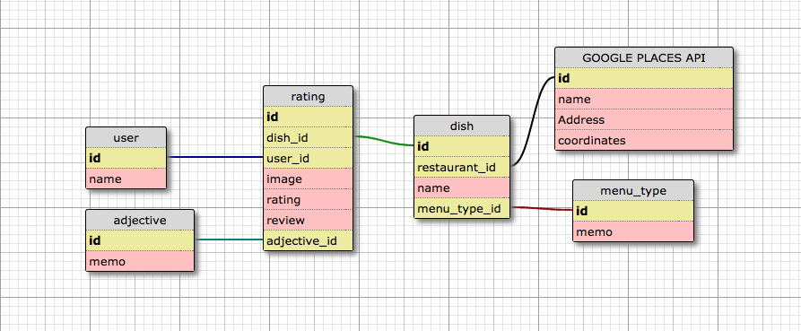

# grubbr

An app to help you find the best dishes in town

## Team

  - __Product Owner__: David d'Aquin (Backend)
  - __Scrum Master__: Nathan Donolli (Frontend)
  - __Unicorn Wrangler__: Živilė Janulevičiūtė Goodwin (Frontend, Design)

## Table of Contents

1. [How it works](#how-it-works)
2. [App Wireframe](#wireframe)
3. [Architecture](#architecture)
4. [Database](#database)
5. [Tech Stack](#tech-stack)
6. [Development](#development)
  6. [System Requirements](#system-requirements)
  6. [Installation](#installation)
  6. [Simulate for Mobile](#simulate-mobile)
7. [Contributing](#contributing)

## <a name="how-it-works"></a>How it Works

> I'm starving for tacos!

Grubbr's got your back. Grubbr will help you find the best tacos in town!  Simply open the app and search "tacos" to see a list of all the best tacos in the city and where to buy them. Perfect! Go wolf one down and leave a thumbs up so others will know how delicious those tacos were!

> I'm at a restaurant and don't know what's good!

Easy. Just tell Grubbr where you're at and you'll see the best rated dishes for that restaurant. Best onion rings in town? We know which side dish you'll be getting! Best bread pudding? Somebody's being a fatty tonight!

> I'm starving but don't know what I want! HALP!

Now introducing: __TENDER!__ A totally original idea where Grubbr will present you with pictures of delicious local food and you can swipe left or right to get matched up with the perfect dish for the evening. Bon appetit!

## <a name="wireframe"></a>App Wireframe


## <a name="architecture"></a>Architecture


## <a name="Database"></a>Database


## <a name="tech-stack"></a>Tech Stack


## <a name="development"></a>Development
Setting up a development environment requires global installations of node, react-native, and CodePush - as well as the latest version of XCode or Android Studio for either iOS or Android development


### <a name="system-requirements"></a>1. System Requirements

* Globally installed [node](https://nodejs.org/en/) >= 4.0

* Globally installed [npm](https://www.npmjs.org/) >= 3.0

* Globally installed [rnpm](https://github.com/rnpm/rnpm) *(only if React Native version < 0.29)*

* Globally installed [react-native CLI](https://facebook.github.io/react-native/docs/getting-started.html)


## <a name="installation"></a>2. Installation

On the command prompt run the following commands

```sh
$ git clone git@github.com:brutsoft/grubbr.git

$ cd grubbr/

$ npm install
```

If React Native < 0.29

```sh
$ rnpm link
```

If React Native >= 0.29

```sh
$ react-native link
```

**For Local Database:**

Grubbr uses **Nodal** which requires a global installation of PostGres.   Installation instructions are provided [here](https://wiki.postgresql.org/wiki/Detailed_installation_guides)

To run local database server:

```
$ cd grubbr-api

$ npm install

$ nodal db:bootstrap
```

## <a name="simulate-mobile"></a>3. Simulate for Mobile Device

**Running on iOS**

* Install the latest version of **XCode** and its dependencies

*	Run the following command in your terminal

```sh
$ react-native run-ios
```
**Running on Android**

* Install the latest version of **Android Studio** or **Android SDK**

*	Make sure you have an **Android emulator** installed and running.

*	Run the following command in your terminal

```sh
$ react-native run-android
```

## <a name="contributing"></a>4. Contributing

See [CONTRIBUTING.md](CONTRIBUTING.md) for contribution guidelines.
